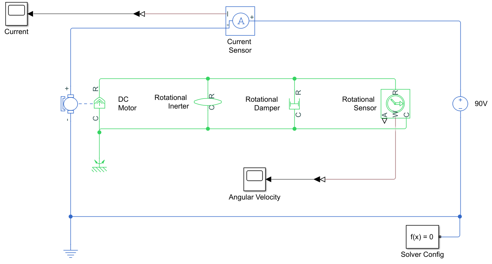

# DC_Motor_MBD
In this repository, you will find Simulink simulations related to a DC motor

## Electro-Mechanical Dynamic Model

The dynamic model of the DC motor was built using components from the Simscape library. 
- The parameters assigned to each component correspond to real-world systems: the BALDOR AP233001 DC motor and the IRF640 MOSFET.
- Sensors are assumed to be ideal for the purposes of these simulations.
