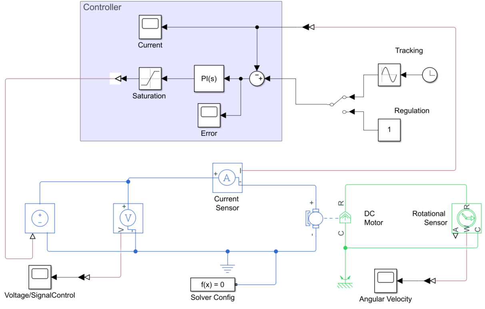

# DC_Motor_MBD
In this repository, you will find Simulink simulations related to a DC motor

## Electro-Mechanical Dynamic Model

The dynamic model of the DC motor was built using components from the Simscape library. 
- The parameters assigned to each component correspond to real-world systems: the BALDOR AP233001 DC motor and the IRF640 MOSFET.
- Sensors are assumed to be ideal for the purposes of these simulations.

## Current PI Control

This simulation implements a Proportional-Integral (PI) current controller. A manual switch block allows toggling between a tracking task and a regulation task as the reference input. 

### Tunning

The tuning process was based on transfer function analysis using the pole placement method, taking into account the natural dynamics of the current.

### Results

The results are shown below

These graphs show the control performance for the tracking task. In the error plot, it can be observed that, despite the PI controller not being specifically designed for tracking tasks, it is able to maintain the error oscillating around zero.

