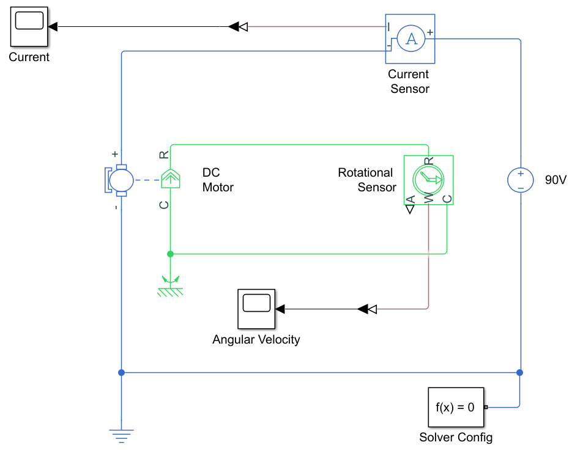
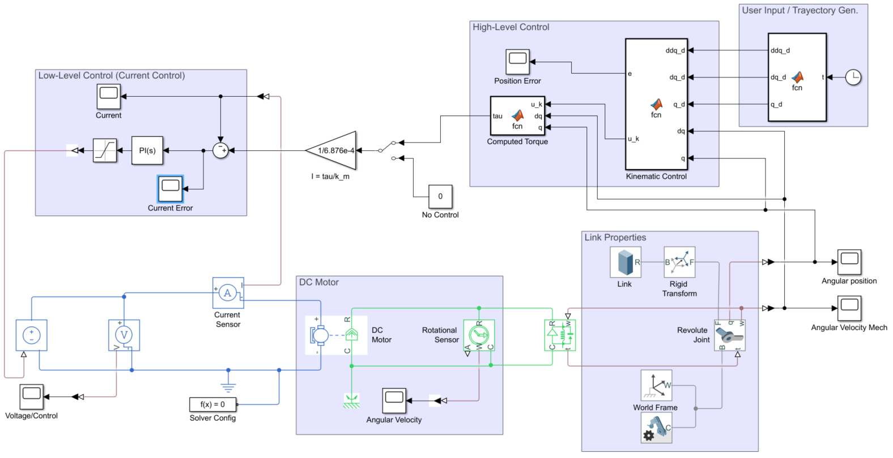

# DC_Motor_MBD
In this repository, you will find Simulink simulations related to a DC motor

## Electro-Mechanical Dynamic Model

The dynamic model of the DC motor was built using components from the Simscape library. 
- The parameters assigned to each component correspond to real-world systems: the BALDOR AP233001 DC motor and the IRF640 MOSFET.
- Sensors are assumed to be ideal for the purposes of these simulations.

## Current PI Control

This simulation implements a Proportional-Integral (PI) current controller. A manual switch block allows toggling between a tracking task and a regulation task as the reference input. 

### Tunning

The tuning process was based on transfer function analysis using the pole placement method, taking into account the natural dynamics of the current.

### Results

The results are shown below

These graphs show the control performance for the tracking task. In the error plot, it can be observed that, despite the PI controller not being specifically designed for tracking tasks, it is able to maintain the error oscillating around zero.

## Cascade Control: Non-Linear Computed Torque + Kinematic Control and PI Control

This simulation models a mechanical link connected to the shaft of a DC motor. As a result, the overall system dynamics encompass both the dynamics of the DC motor and those of the mechanical link, which is treated as a constrained rigid body.
- The simulation employs Simscape Multibody blocks, including: World Frame, Revolute Joint, Rigid Transformation, and Body.
- The control architecture adopts a cascade structure, comprising a high-level controller and a low-level controller.
- The high-level controller applies a nonlinear computed torque strategy based on kinematic control. This method compensates for the nonlinear dynamics of the rigid body and enforces a desired second-order dynamic response.
- The high-level controller generates a desired torque, which is then converted into a current reference through a linear transformation. This current reference is subsequently provided to the low-level controller.

